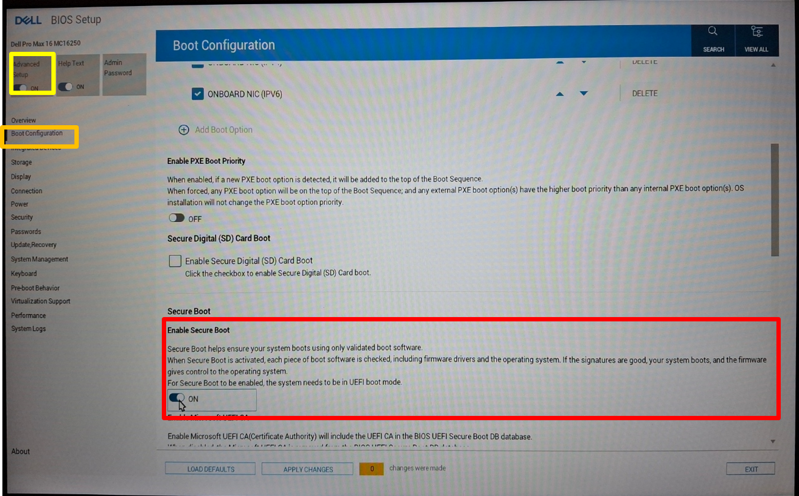

<h1 align="center">
	
</h1>

Welcome to the Olin Electric Motorsports monorepo. This is the home for all of our
electrical, firmware, and software work.

This document will help you get started contributing and walk you through
important steps for collaborating with teammates.

Instructions Information:
- Made for Dell Pro Max 16 (2025)
- Installs Ubuntu 24.04.3 LTS
- Updated as of 09-30-2025

## Computer Setup
### Windows Tasks + Pre-Ubuntu Installation Tasks
1) Disable BitLocker

	Go to your Windows Search Bar and search for `BitLocker`. Select your C: drive and decrypt your drive (red box). Ubuntu cannot get installed if your drive is encrypted!

	<h3 align="center">
		
	</h3>

2) Shrink Windows Partition by ~64 GB

	Open a Windows Run Window by pressing `Win (Windows Key) + R`. Type in the search bar `diskmgmt.msc`. Right click C: drive and select shrink drive option.

	<h3 align="center">
		
	</h3>
	
	Type in 64000 for "Amount of space to shrink in MB" (red box) and click "Shrink".

	<h3 align="center">
		
	</h3>

3) Reboot your computer and enter the UEFI (BIOS) by spam pressing F12 on your keyboard when your computer starts up.
4) Navigate to BIOS/UEFI Settings (red box)

	<h3 align="center">
		
	</h3>

5) Disable Secure Boot. First toggle "Advanded Setup" options (yelloow box). Next select the "Boot Configuration" tab (orange box) and scroll down to the "Secure Boot" section.

	<h3 align="center">
		
	</h3>

6) Apply your changes and reboot your computer.
### Ubuntu 24.04.3 LTS
1) Get Ubuntu Install USB Flash Drive (or make your own; download the ISO from here: [https://releases.ubuntu.com/24.04.3/ubuntu-24.04.3-desktop-amd64.iso](https://releases.ubuntu.com/24.04.3/ubuntu-24.04.3-desktop-amd64.iso))
2) Turn on your computer again and pam pressing F12 on your keyboard when your computer starts up.
3) On the boot menu screen, select the USB flash disk option (has the USB logo to the left).
4) Go through the menus for installing Ubuntu 24.04.3 LTS. Leave the default options selected. **Make sure you are selecting "Install Ubuntu along side Windows Boot Manager".** You don't want to overwrite Windows (unless you do, you do you)! When asked if you want to install 3rd party drivers, select yes.

### Pre-Installation Tasks
1) **Install cURL**

	This tool will be used later on to download packages during the onboarding process.

	```bash
	sudo apt install curl
	```

2) **Update Ubuntu Packages List**

	This is so the system knows what is installed and will help prevent headaches down the road.

	```bash
	sudo apt-get update
	```

### Python 3 + Miniconda Virtual Environment
1) **Download and Install Miniconda**

	Just run the following commands to install Miniconda. The commands download the installer script from the Anaconda website to `~/Downloads/miniconda.sh`, make the script executable, and execute the script.

	```bash
	curl -L https://repo.anaconda.com/miniconda/Miniconda3-latest-Linux-x86_64.sh > ~/Downloads/miniconda.sh && 
	chmod -v +x ~/Downloads/miniconda.sh && 
	cd ~/Downloads && 
	./miniconda.sh
	```

2) **Restart your terminal**
	
	Close and open your terminal window again. You should see that `(base)` appears to the left of your username. If you do not see that, restart your shell again and/or restart your computer.

3) **Accept Conda Terms of Service (TOS)**

	Accept Conda's TOS. You need to accept the TOS to download packages to create your virtual environment later.

	- Anaconda Terms of Service: https://www.anaconda.com/legal/terms/terms-of-service
    - Anaconda Privacy Policy: https://www.anaconda.com/legal/privacy-policy

	```bash
	conda tos accept --override-channels --channel https://repo.anaconda.com/pkgs/main
	conda tos accept --override-channels --channel https://repo.anaconda.com/pkgs/r
	```

4) **Create the OEM Conda Environment**

	This creates your Conda virtual environment from which all the OEM associated python libraries will be. We will use Python version 3.10 to ensure all the libraries work as expected with Bazel (which will be installed later).

	```bash
	conda create -n oem python=3.10 -y
	```

5) **Set OEM Conda Environment to Auto-Activate on Terminal Start**

	This is so you are working with the OEM environment by default. This will help prevent headaches in the future by preventing situations in which you are in the wrong environment and that causes weird issues.

	```bash
	conda config --set auto_activate_base false
	echo "conda activate oem" >> ~/.bashrc
	```

6) **Restart your terminal again**

	Close and open your terminal window again. You should see that `(oem)` appears to the left of your username. If you do not see that, restart your shell again and/or restart your computer.

### Git
This command installs Git. We use Git to keep track of changes and store all our OEM files to be accessed by team members in the future.

```bash
sudo apt install git-all
```

### Bazel
These commands install Bazelisk which is a wrapper for Bazel. Bazel itself is a tool that we use for various things like compiling code and flashing firmware to a board. Bazelisk will automatically install the appropriate version of Bazel that you need.

```bash
curl -L https://github.com/bazelbuild/bazelisk/releases/latest/download/bazelisk-linux-amd64 > ~/Downloads/bazelisk
chmod +x ~/Downloads/bazelisk
sudo mv ~/Downloads/bazelisk /usr/local/bin/bazel
```

### KiCad 9.0
These commands install KiCad version 9.0. We use KiCad to create schematics and design our PCBs.

```bash
sudo add-apt-repository ppa:kicad/kicad-9.0-releases &&
sudo apt update &&
sudo apt install kicad
```

### VS Code
This command installs VS Code. We use VS Code to write our firmware in!

```bash
sudo snap install --classic code
```

### Toolchain (AVR - ATmega 16M1/64M1)
All of these packages are used to flash firmware onto the boards with ATmega 16M1 or 64M1 microcontrollers. Generally all boards prior to Mk. VIII (Design Year 2025-26) were all used this microcontroller. **You only need to install these packages if you are interacting with a board with an ATmega microcontroller.**

```bash
sudo apt install gcc-avr avrdude avr-libc binutils-avr gdb-avr
```

### Toolchain (ARM - STM32G441KB/STM32G474RE)
All of these packages are used to flash firmware onto the boards with STM32G441KB or STM32G474RE microcontrollers. All boards made for Mk. VIII (Design Year 2025-26) and after used this microcontroller.

```bash
```

### Slack
Slack is our main form of communication in OEM. This command will download the desktop version of Slack to your computer.

```bash
sudo snap install slack
```

### Other Packages
1) **Cantools**

	*Make sure you are on the oem conda virtual environment for this step. If `(oem)` appears to the left of your username, you are good!*

	This library is used to help us read CAN messages from the car.

	```bash
	pip3 install cantools
	```

2) **can-utils**

	This library allows us to interact with the CAN bus via a CANable.

	```bash
	sudo apt install can-utils
	```

3) **Click**

	*Make sure you are on the oem conda virtual environment for this step. If `(oem)` appears to the left of your username, you are good!*
		
	Allows us to convert symbols to library and so on... desc

	```bash
	pip3 install click
	```

### Miscellaneous Ubuntu Configuration
1) **Windows + Ubuntu Time Differences Fix**

	This command will correct time differences between Windows and Ubuntu. It will fix time offset issues when you switch between the operating systems. This is optional.

	```bash
	sudo timedatectl set-local-rtc 1
	```

2) **Remove Temporary Files**

	You can now safely delete any files that were created during the setup process. These files can include `miniconda.sh` among others.
 
## Software Setup
### Git + GitHub
We need to connect your GitHub account to your computer's specific git instance (which we installed previously). We do this for safety: someone pretending to be you can't add code to our repo!

Before continuing, make sure you have a GitHub account. If you don't, create one on [GitHub](github.com) (this website). Make sure to save your username, email, and password. This will be useful in the next steps. Once you have an account, STOP, and ask a lead/senior engineer to add you to the `olin-electric-motorsports` org.


1) **Set Your GitHub Username**

	Replace `['your username here']` with your username.

	```bash
	git config --global user.name '[your username here]'
	```

2) **Set Your Email Address**

	This is your email that you used to create your GitHub account. Replace `[your email here]`.

	```bash
	git config --global user.email '[your email here]'
	```

3) **Create an SSH Key**
	
	An SSH Key is essentially a super crazy long password. When you’re prompted to "Enter a file in which to save the key," press `Enter`. This accepts the default file location. At the password prompt, hit `Enter` again (you do not need to set a password for SSH Key).

	```bash
	ssh-keygen -t ed25519 -C '[your email here]'
	```

4) **Add Your SSH Key in GitHub**

	In your github page, go to your profile (Top Right) > `Settings` > `SSH and GPG Keys`. Click on the green `New SSH Key` button. Title your key as `Olin Computer` (or something else that means something to you) and paste in your SSH key. Finally, click the green `Add SSH Key` button.

	Run the command below to get the SSH key to copy to the GitHub website.

	```bash
	cat ~/.ssh/id_ed25519.pub
	```

5) **Test Connection to GitHub**
	
	Test your ssh connection by using the command below. Type `yes` when prompted. You've done this step correctly if you see something along the lines of `Hi "username"! You've successfully authenticated, but GitHub does not provide shell access.`

	```bash
	ssh -T git@github.com
	```

6) **Clone the olin-electric-motorsports GitHub Repo**

	First navigate to the folder in which you would like to clone the OEM repo to; most people prefer to clone the repo to their `~\Documents` folder. Afterwards, run the following command to clone the repo.

	```bash
	git clone git@github.com:olin-electric-motorsports/olin-electric-motorsports.git
	```

### KiCad
We need to setup your KiCad installation with certain settings to make sure you have access to our schematic symbols, 3D models, and footprints.

*Note: In the paths below, `[your-username]` is to be replaced with your username on your computer.*

*Note: The paths below assume you cloned the `olin-electric-motorsports` directory to your `/home/[your-username]/Documents` folder. If you did not clone the `olin-electric-motorsports` directory to your `/home/[your-username]/Documents` folder, you will need to change the `/home/[your-username]/Documents` part of the paths to match where you cloned the `olin-electric-motorsports` directory.*

1) **Open KiCad**

	To open KiCad, you can press `Win (Windows Key)` and type `KiCad`. Click on the blue app (always do this when opening Kicad, otherwise you can corrupt files!). Hit `Enter` if asked about settings imports and auto-updates for add-ons.

2) **Add Paths**

	This path will be used as a shortcut for paths we will enter later.
	
	From the top bar, open *Preferences > Configure Paths...*. Add a new row to the table using the plus button (you will have to fill out TWO fields... shown below) and then click `ok`.

	Name | Path
	-----|-----
	OEM\_DIR|`/home/[your-username]/Documents/olin-electric-motorsports`
	OEM_


3) **Add OEM Schematic Symbols Library**

	From the top bar, open _Preferences > Manage Symbol Libraries ..._. Same deal as before with the new line at the bottom, new values though this time:

	Name | Path
	-----|-----
	OEM |`${OEM_DIR}/parts/schematic/OEM.kicad_sym`

4) **Add OEM Footprints Library**

	From the top bar, open *Preferences > Manage Footprint Libraries ...*.
	3rd time's the magic one, plus button, add the values in the table below and then click `ok`.

	Name | Path
	-----|-----
	OEM |`${OEM_DIR}/parts/oem.pretty`
5) **Add OEM Project Template**


	```bash	
	cp -R ~/Documents/olin-electric-motorsports/projects/oem_project_template ~/.local/share/kicad/9.0/template
	```